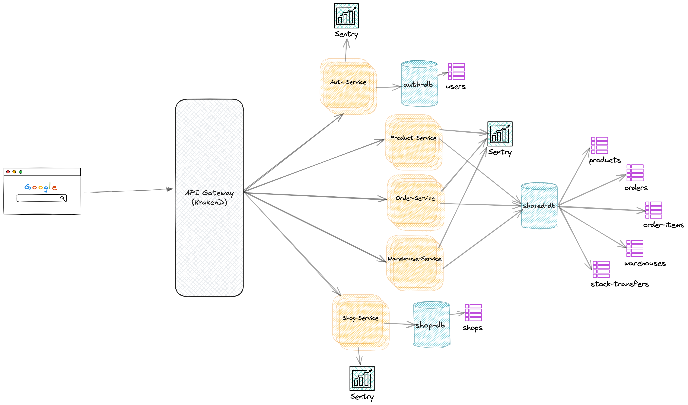

# E-Commerce Microservices Platform

A modern e-commerce platform built with microservices architecture using Go, PostgreSQL, and Docker.

## Services Overview

### 1. Authentication Service
- User registration and authentication
- JWT token management
- User profile management

**Endpoints:**
- POST `/api/v1/auth/signup` - Register new user
- POST `/api/v1/auth/signin` - User login
- POST `/api/v1/auth/refresh` - Refresh access token
- GET `/api/v1/me` - Get user profile

### 2. Product Service
- Product catalog management
- Product search and filtering
- Product category management

**Endpoints:**
- GET `/api/v1/product` - List all products
- GET `/api/v1/product/{id}` - Get product details

### 3. Order Service
- Order processing
- Order history
- Payment integration

**Endpoints:**
- POST `/api/v1/orders/checkout` - Create new order

### 4. Shop Service
- Shop management
- Shop analytics
- Shop settings

**Endpoints:**
- POST `/api/v1/shop` - Create new shop
- GET `/api/v1/shop/{id}/warehouses` - Get shop warehouses

### 5. Warehouse Service
- Inventory management
- Stock transfer
- Warehouse operations

**Endpoints:**
- POST `/api/v1/warehouse` - Create warehouse
- PATCH `/api/v1/warehouse/{id}/status` - Update warehouse status
- POST `/api/v1/warehouse/transfer` - Transfer stock
- GET `/api/v1/warehouse/{id}/stock` - Get warehouse stock

## Technology Stack

### Core Technologies
- **Go (1.21+)** - Main programming language
- **PostgreSQL (14+)** - Primary database
- **Docker** - Containerization
- **Docker Compose** - Container orchestration
- **KrakenD** - API Gateway
- **JWT** - Authentication
- **OpenAPI/Swagger** - API documentation
- **Testify** - Testing framework

### Go Libraries
- **Echo** - Web framework
- **GORM** - ORM
- **go-migrate** - Database migrations
- **testify** - Testing
- **zap** - Logging
- **viper** - Configuration
- **validator** - Request validation

## Project Structure

```
.
├── LICENSE
├── Makefile
├── README.md
├── app
│  └── app.go
├── cmd
│  ├── load_data.go
│  ├── root.go
│  └── serve.go
├── config
│  └── config.go
├── db
│  ├── fixtures
│  │  └── test_users.yml
│  └── migrations
│      ├── 20250208013226_create_users_table.down.sql
│      └── 20250208013226_create_users_table.up.sql
├── deployments
│  ├── Dockerfile
│  ├── Dockerfile.load
│  ├── docker-compose.e2e-local.yaml
│  ├── docker-compose.yaml
│  └── init-scripts
│      └── init.db.sh
├── docs.md
├── envs
│  ├── local.env
│  ├── production.env
│  ├── stage.env
│  └── test.env
├── external
│  └── sample_ext_service
│      ├── domain
│      │  └── sample_ext_service_domain.go
│      └── usecase
│          └── sample_ext_service_usecase.go
├── go.mod
├── go.sum
├── golangci.yaml
├── internal
│  ├── auth
│  │  ├── configurator
│  │  │  └── auth_configurator.go
│  │  ├── delivery
│  │  │  ├── grpc
│  │  │  │  └── auth_grpc_controller.go
│  │  │  ├── http
│  │  │  │  ├── auth_http_controller.go
│  │  │  │  └── auth_http_router.go
│  │  │  └── kafka
│  │  │      ├── consumer
│  │  │      │  ├── consumer.go
│  │  │      │  └── worker.go
│  │  │      └── producer
│  │  │          └── producer.go
│  │  ├── domain
│  │  │  └── auth_domain.go
│  │  ├── dto
│  │  │  ├── create_auth_dto.go
│  │  │  └── profile_dto.go
│  │  ├── exception
│  │  │  └── auth_exception.go
│  │  ├── job
│  │  │  ├── job.go
│  │  │  └── worker.go
│  │  ├── repository
│  │  │  └── auth_repo.go
│  │  ├── tests
│  │  │  ├── fixtures
│  │  │  │  └── auth_integration_fixture.go
│  │  │  └── integrations
│  │  │      └── auth_test.go
│  │  └── usecase
│  │      └── auth_usecase.go
│  └── health_check
│      ├── configurator
│      │  └── health_check_configurator.go
│      ├── delivery
│      │  ├── grpc
│      │  │  └── health_check_grpc_controller.go
│      │  └── http
│      │      ├── health_check_http_controller.go
│      │      └── health_check_http_router.go
│      ├── domain
│      │  └── health_check_domain.go
│      ├── dto
│      │  └── health_check_dto.go
│      ├── tests
│      │  ├── fixtures
│      │  │  └── health_check_integration_fixture.go
│      │  └── integrations
│      │      └── health_check_test.go
│      └── usecase
│          ├── health_check_usecase.go
│          ├── kafka_health_check
│          │  └── kafka_health_check_usecase.go
│          ├── postgres_health_check
│          │  └── postgres_health_check_usecase.go
│          └── tmp_dir_health_check
│              └── tmp_dir_health_check_usecase.go
├── main.go
└── pkg
    ├── constant
    │  ├── constant-temp.go
    │  ├── constant.go
    │  ├── error
    │  │  ├── error_list
    │  │  │  └── error_list.go
    │  │  └── error_title.go
    │  ├── httputil.go
    │  └── logger
    │      └── logger.go
    ├── constant.go
    ├── error
    │  ├── contracts
    │  │  └── contracts.go
    │  ├── custom_error
    │  │  ├── application_error.go
    │  │  ├── bad_request_error.go
    │  │  ├── conflict_error.go
    │  │  ├── custom_error.go
    │  │  ├── domain_error.go
    │  │  ├── forbiden_error.go
    │  │  ├── internal_server_error.go
    │  │  ├── marshaling_error.go
    │  │  ├── not_found_error.go
    │  │  ├── unauthorized_error.go
    │  │  ├── unmarshaling_error.go
    │  │  └── validation_error.go
    │  ├── error_utils
    │  │  └── error_utils.go
    │  ├── grpc
    │  │  ├── custom_grpc_error.go
    │  │  ├── grpc_error.go
    │  │  └── grpc_error_parser.go
    │  └── http
    │      ├── custom_http_error.go
    │      ├── http_error.go
    │      └── http_error_parser.go
    ├── jwt_token.go
    ├── password.go
    ├── response
    │  ├── error.go
    │  └── response.go
    ├── sql.go
    ├── string.go
    └── utils.go
```

## Database Schema

Each service has its own database with the following key tables:

### Auth Service
```sql
CREATE TABLE users (
   "id" uuid DEFAULT uuid_generate_v4() PRIMARY KEY,
   "username" VARCHAR(254) UNIQUE NOT NULL,
   "password" VARCHAR(200) NOT NULL,
   "created_at" TIMESTAMP WITH TIME ZONE DEFAULT CURRENT_TIMESTAMP,
   "updated_at" TIMESTAMP WITH TIME ZONE DEFAULT CURRENT_TIMESTAMP,
   "deleted_at" TIMESTAMP WITH TIME ZONE DEFAULT NULL
);

```

### Product Service
```sql
CREATE TABLE products (
  "id" uuid DEFAULT uuid_generate_v4() PRIMARY KEY,
  "name" VARCHAR(254) UNIQUE NOT NULL,
  "description" text NOT NULL,
  "category_id" uuid DEFAULT uuid_generate_v4(),
  "price" DECIMAL(15,2) NOT NULL,
  "status" bool NOT NULL,
  "created_at" TIMESTAMP WITH TIME ZONE DEFAULT CURRENT_TIMESTAMP,
  "updated_at" TIMESTAMP WITH TIME ZONE DEFAULT CURRENT_TIMESTAMP,
  "deleted_at" TIMESTAMP WITH TIME ZONE DEFAULT NULL
);
```

### Order Service
```sql
CREATE TABLE orders (
    "id" uuid DEFAULT uuid_generate_v4() PRIMARY KEY,
    "user_id" uuid  NULL,
    "status" order_status DEFAULT 'pending',
    "total_amount" DECIMAL(15,2) NOT NULL,
    "payment_deadline" TIMESTAMP,
    "created_at" TIMESTAMP WITH TIME ZONE DEFAULT CURRENT_TIMESTAMP,
    "updated_at" TIMESTAMP WITH TIME ZONE DEFAULT CURRENT_TIMESTAMP,
    "deleted_at" TIMESTAMP WITH TIME ZONE DEFAULT NULL
);

CREATE TABLE order_items (
     "id" uuid DEFAULT uuid_generate_v4() PRIMARY KEY,
     "order_id" uuid  NULL,
     "product_id" uuid   NULL,
     "warehouse_id" uuid   NULL,
     "quantity" INT NOT NULL,
     "price" DECIMAL(15,2) NOT NULL,
     "stock_status" stock_status DEFAULT 'released',
     "created_at" TIMESTAMP WITH TIME ZONE DEFAULT CURRENT_TIMESTAMP,
     "updated_at" TIMESTAMP WITH TIME ZONE DEFAULT CURRENT_TIMESTAMP,
     "deleted_at" TIMESTAMP WITH TIME ZONE DEFAULT NULL
);
```

### Shop Service
```sql
CREATE TABLE shops (
   "id" uuid DEFAULT uuid_generate_v4() PRIMARY KEY,
   "name" VARCHAR(255) NOT NULL,
   "created_at" TIMESTAMP WITH TIME ZONE DEFAULT CURRENT_TIMESTAMP,
   "updated_at" TIMESTAMP WITH TIME ZONE DEFAULT CURRENT_TIMESTAMP,
   "deleted_at" TIMESTAMP WITH TIME ZONE DEFAULT NULL
);
```

### Warehouse Service
```sql
CREATE TABLE warehouses (
    "id" uuid DEFAULT uuid_generate_v4() PRIMARY KEY,
    "shop_id"  uuid NULL,
    "name" VARCHAR(255) NOT NULL,
    "status" bool NOT NULL,
    "created_at" TIMESTAMP WITH TIME ZONE DEFAULT CURRENT_TIMESTAMP,
    "updated_at" TIMESTAMP WITH TIME ZONE DEFAULT CURRENT_TIMESTAMP,
    "deleted_at" TIMESTAMP WITH TIME ZONE DEFAULT NULL
);

-- Stock table
CREATE TABLE stocks (
    id UUID PRIMARY KEY,
    warehouse_id UUID NOT NULL,
    product_id UUID NOT NULL,
    quantity INTEGER NOT NULL,
    created_at TIMESTAMP NOT NULL,
    updated_at TIMESTAMP NOT NULL
);

CREATE TABLE warehouse_stocks (
  "id" uuid DEFAULT uuid_generate_v4() PRIMARY KEY,
  "warehouse_id" uuid NOT NULL,
  "product_id" uuid NOT NULL,
  "quantity" INT NOT NULL DEFAULT 0,
  "created_at" TIMESTAMP WITH TIME ZONE DEFAULT CURRENT_TIMESTAMP,
  "updated_at" TIMESTAMP WITH TIME ZONE DEFAULT CURRENT_TIMESTAMP,
  "deleted_at" TIMESTAMP WITH TIME ZONE DEFAULT NULL
);
```

## Getting Started

### Prerequisites
- Go 1.23.3
- Docker and Docker Compose
- Make
- PostgreSQL 11.16 (for local development)

### Setup
1. Clone the repository:
```bash
git clone https://github.com/diki-haryadi/e-commerce-test.git
cd e-commerce-test
```

2. Start the services:
```bash
make up
```


### Available Make Commands
```
# Start all services
up:
    docker-compose up -d

# Stop all services
down:
    docker-compose down

# Run tests
test:
    go test ./... -v

# Run integration tests
test-integration:
    go test ./... -tags=integration -v

```

## Testing

### Unit Tests
Run unit tests with:
```bash
make test
```

### Integration Tests
The project uses test suites for organized testing. Run integration tests with:
```bash
make test-integration
```

## API Documentation
The API is documented using OpenAPI. Access the documentation at:
[openapi.yml](openapi/openapi.yml)
[docs.md](docs.md)

## Monitoring and Logging

- Each service uses structured logging with Zap
- Sentry

## Contributing

1. Fork the repository
2. Create a feature branch
3. Commit your changes
4. Push to the branch
5. Create a Pull Request

## License

This project is licensed under the MIT License - see the LICENSE file for details.